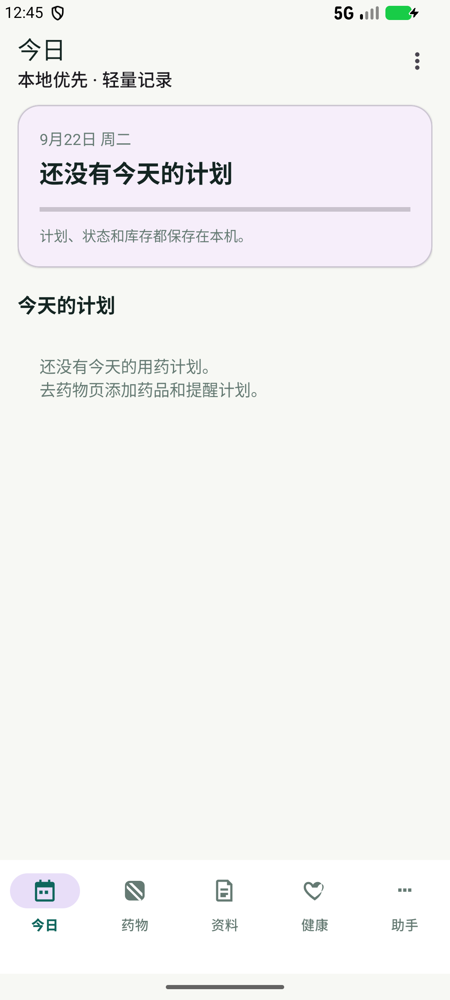
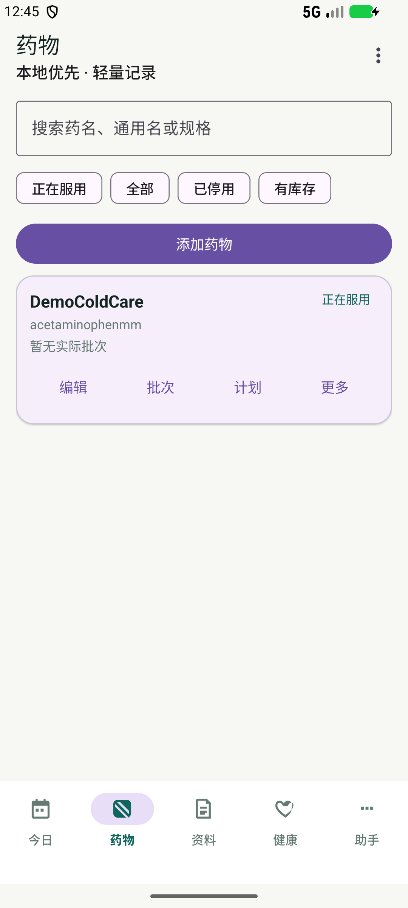
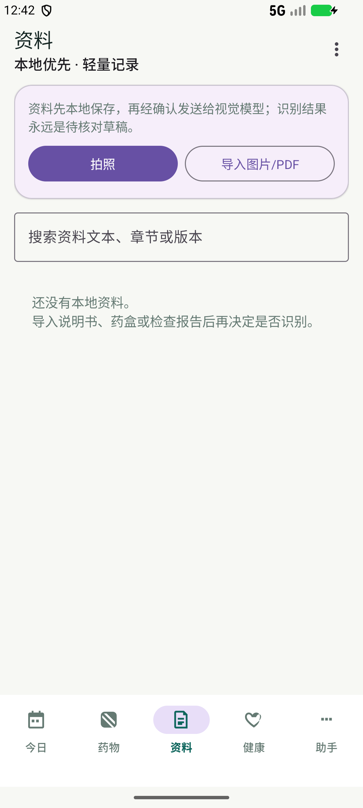
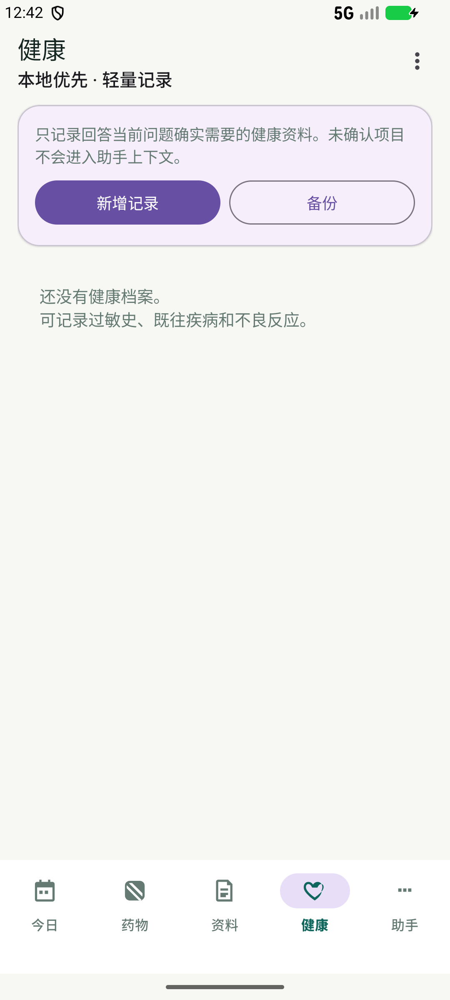
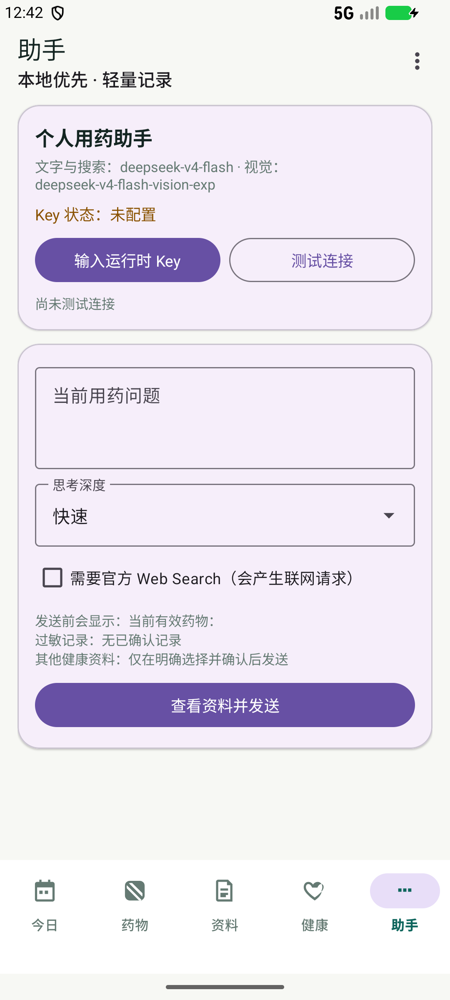

# 个人用药助手 · v0.3.0

[简体中文](README.md) | [English](README_EN.md)

一个本地优先的 Android 用药记录与提醒应用：今日计划、药物/批次/库存、资料草稿、健康档案和可审计的 AI 助手分成五个页面。`applicationId` 保持 `com.lunamax.medassistant`，当前 Debug 构建为 versionCode 3 / versionName 0.3.0。

## 页面预览

截图来自 API 36.1 AVD，使用匿名 demo 药物记录；不含真实 Key 或个人健康资料。

<p align="center">
  <a href="docs/screenshots/v0.3-today.png"></a>
  <a href="docs/screenshots/v0.3-medications.png"></a>
  <a href="docs/screenshots/v0.3-documents.png"></a>
</p>
<p align="center">
  <a href="docs/screenshots/v0.3-health.png"></a>
  <a href="docs/screenshots/v0.3-assistant.png"></a>
</p>

## 核心边界

- 计划、状态、库存、健康资料、视觉草稿和助手会话默认保存在本机 SQLite；敏感字段使用 Android Keystore AES/GCM。
- DeepSeek 文本与搜索固定 `deepseek-v4-flash`；视觉草稿固定 `deepseek-v4-flash-vision-exp`。
- 运行时 API Key 使用独立 Keystore alias 保存，不进入备份、日志或源码。联网、Web Search 和视觉识别都需要用户明确确认。
- AI 只产生来源明确、带不确定性的建议或待确认草稿，不替代医生、药师、说明书或急救服务。

## 构建与验收

```powershell
Set-Location 'G:\项目\药\android-app'
$env:JAVA_HOME = 'C:\Program Files\Android\Android Studio\jbr'
.\gradlew.bat :app:assembleDebug --no-daemon --console=plain
```

完整命令、Windows 中文路径单元测试 workaround、网关测试和外部验收门禁见 [构建说明](docs/构建说明.md)、[测试与已知限制](docs/测试与已知限制.md) 和 [第 17 轮验收报告](17_第四轮产品化重构验收报告.md)。

默认 Debug APK：`android-app/app/build/outputs/apk/debug/app-debug.apk`。
版本化交付副本：`个人用药助手-v0.3.0-debug.apk`（不纳入源码提交，供安装或 Release 附件使用）。
最终 GitHub 仓库：[freminet-pers/personal-medication-assistant-android](https://github.com/freminet-pers/personal-medication-assistant-android)（私有审计通过后公开）。
Release 下载：[v0.3.0 Release](https://github.com/freminet-pers/personal-medication-assistant-android/releases/tag/v0.3.0)。

## 隐私与运行时 Key

本仓库不包含真实 API Key。请只通过应用运行时输入或安全环境变量提供 Key；不要把 Key 写入 Git、文档、日志、APK 或测试夹具。没有 Key 时可使用离线功能，资料可保存为等待识别。

## 许可证与第三方

本项目使用 [MIT License](LICENSE)。DeepSeek Harness 接口边界和固定审计提交见 [第三方声明](docs/第三方声明.md)。本项目是个人健康记录工具，不提供医疗诊断。
